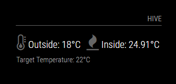

# MMM-Hive
A module for the MagicMirror project (https://github.com/MichMich/MagicMirror) to display inside / outside temperature from your Hive receiver



## Installation
WIP

## Config

|Option|Description|
|---|---|
|`username`|**Required** This is your Hive username.<br><br>**Type:** `string`<br>|
|`password`|**Required** This is your Hive password.<br><br>**Type:** `string`<br>|
|`postcode`|**Required** Your post code<br><br>**Type:** `string`<br>|
|`updateInterval `|How often the termperature information is updated.<br><br>**Type:** `integer`<br>**Default value:** `1 min`|
| `showNext` | Whether to display the Target Temperature (true) or not (false)<br><br>**Type:** `bool`<br>**Possible values:** `true` or `false` <br> **Default value:** `true`|
| `initialLoadDelay`           | The initial delay before loading (Milliseconds) <br><br>**Type:** `integer`<br>**Possible values:** `1000` - `5000` <br> **Default value:**  `0`|

Example of the config.js entry:

```
		{
			module: "MMM-Hive",
			header: "Hive",
			position: "top_right",
			config: {
				temperatureSuffix: "°C",
				username: "hive@hive.com",
				password: "password",
				postcode: 'P0STC0D3',
				showNext: true,
			},
		},
```
## A massive thanks to the following:
- [Graham White](https://github.com/grahamwhiteuk/) for the [bg-hive-api-v6](https://github.com/grahamwhiteuk/bg-hive-api-v6) api, which I used as reference
- [Michael Teeuw](https://github.com/MichMich) for the awesome [MagicMirror2](https://github.com/MichMich/MagicMirror/)
- [James Saunders](http://www.smartofthehome.com/2016/05/hive-rest-api-v6/) for the very detailed breakdown of the Hive api v6
