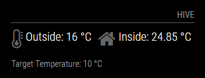
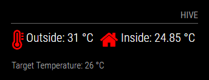
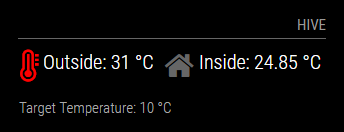
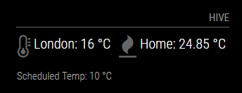
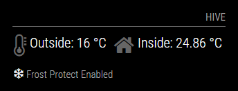

# MMM-Hive
A module for the [MagicMirror project](https://github.com/MichMich/MagicMirror) to display inside / outside temperature from your Hive receiver.

Hive has had some changes to the login process and the previous way of logging in no longer works.  I believe I have this working now, but there are a number of processes so I may have missed something.

Due to this the installation process is a lot more involved than before.

Text and the inside icon are configurable, and the thermometer icon is dynamic based on the temperature values set in the config file.





With configuration changes to the text and icon:<br><br>


Target Temperature will change when the inside temperature is equal to / less than 1 °C (I am using this to detect whether Frost Protect mode is enabled as I do not believe there is a specific on/off value).



## Installation

Clone this repository in your `~/MagicMirror/modules/` folder `( $ cd ~MagicMirror/modules/ )`:
```
git clone https://github.com/flick116/MMM-Hive
```

The following will only work when 2FA is disabled in the APP - once complete and you have the populated HiveTokens.json, 2FA can be enabled again.

The following commands are to be run in the terminal one after the other - the assumption is that you are using the pi user, if not then this will need to be changed below as appropriate:
```
cd /home/pi
```
```
sudo apt-get install npm
```
```
npm install amazon-user-pool-srp-client --save
```
```
npm install axios --save
```
```
cd /home/pi/node_modules/amazon-user-pool-srp-client
```
You will now need to copy the index.js from ~MagicMirror/modules/MMM-Hive/tokenGeneration to /home/pi/node_modules/amazon-user-pool-srp-client overwriting the existing file

Edit index.js and add your Hive login/password credentials to the end of the file (login('xxxx@xxxxxx.com','xxxxxxxxx')):
```
nano /home/pi/node_modules/amazon-user-pool-srp-client/index.js
```
Final commands create the file that contains the Hive tokens that are used for logging in:
```
export CognitoUserPoolUsers=eu-west-1_SamNfoWtf CognitoUserPoolClientWeb=3rl4i0ajrmtdm8sbre54p9dvd9
```
```
node /home/pi/node_modules/amazon-user-pool-srp-client/index.js > /home/pi/node_modules/amazon-user-pool-srp-client/HiveTokens.json
```
If there are any errors relating to tokens, the the above step will need to be re-run.

## Dependencies

[request](https://www.npmjs.com/package/request)

## Config

|Option|Required|Description|
|---|---|---|
|`postcode`|Yes|Your post code (no spaces)<br><br>**Type:** `string`|
|`updateInterval`|No|How often the temperature information is updated.<br><br>**Type:** `integer`<br>**Default value:** `10 * 60000`|
|`initialLoadDelay`|No|The initial delay before loading (Milliseconds) <br><br>**Type:** `integer`<br>**Possible values:** `1000` - `5000` <br> **Default value:**  `0`|
|`showNext`|No|Whether to display the Target Temperature (true) or not (false)<br><br>**Type:** `bool`<br>**Possible values:** `true` or `false` <br> **Default value:** `true`|
|`outsideUrl`|No|Option in case British Gas change the Hive URL<br><br>**Type:** `string`|
|`insideUrl`|No|Option in case British Gas change the Hive URL<br><br>**Type:** `string`|
|`loginUrlPlus`|No|Option in case British Gas change the Hive URL, currently '/cognito/login'<br><br>**Type:** `string`|
|`insideUrlProducts`|No|Option in case British Gas change the Hive URL, currently '/products'<br><br>**Type:** `string`|
|`insideUrlDevices`|No|Option in case British Gas change the Hive URL, currently '/devices'<br><br>**Type:** `string`|
|`temperatureSuffix` | No | Text to change the temperature suffix<br><br>**Type:** `string`<br>**Default value:** `°C`|
|`insideText` | No | Option to change the default 'Inside:' text<br><br>**Type:** `string`|
|`outsideText` | No | Option to change the default 'Outside:' text<br><br>**Type:** `string`|
|`targetTempText` | No | Whether to display the Target Temperature row (true) or not (false)<br><br>**Type:** `bool`<br>**Possible values:** `true` or `false` <br> **Default value:** `true`|
|`insideIconSet` | No | Option to change the default 'fire' icon, can change to any of the available icons at<br>[font awesome](http://fontawesome.io/icons/)<br><br>**Type:** `string`<br>**Possible values:** `fa fa-fire` <br> **Default value:** `fa fa-home`|
|`highestTemp` | No | Set the highest temperature value, which when reached will use the 'full thermometer' icon, plus turn the icon red<br><br>**Type:** `integer`<br> **Default value:** `30`|
|`highTemp` | No | Set the high temperature value, which when reached will use the 'three quarters full thermometer' icon<br><br>**Type:** `integer`<br> **Default value:** `25`|
|`lowTemp` | No | Set the low temperature value, which when reached will use the 'half full thermometer' icon<br><br>**Type:** `integer`<br> **Default value:** `20`|
|`lowestTemp` | No | Set the lowest temperature value, which when reached will use the 'quarter full thermometer' icon<br>(anything below this temperature will use the 'empty thermometer' icon)<br><br>**Type:** `integer`<br> **Default value:** `15`|
|`animatedLoading` | No | Whether to display the animated loading icon (true) or just plain text (false)<br><br>**Type:** `bool`<br>**Possible values:** `true` or `false` <br> **Default value:** `true`|
|`nodeName` | No | In case of a multi-node setup, you will need to define this setting. If the inside temperature is not being<br>reported then set this to either `Receiver` or `Receiver 2`<br><br>**Type:** `string`<br>**Default value:** `Your Receiver`|
|`debug` | No | Whether debug is enabled (true) or note (false).  When enabled responses from<br>Hive are output to the console<br><br>**Type:** `bool`<br>**Possible values:** `true` or `false` <br> **Default value:** `true`|
|`batteryIcon`|No|Whether to display the Thermostat battery level (true) or not (false) - This setting hasn't been fully tested!<br><br>**Type:** `bool`<br>**Possible values:** `true` or `false` <br> **Default value:** `true`|

Example of the config.js entry:

```
		{
			module: "MMM-Hive",
			header: "Hive",
			position: "top_right",
			config: {
				temperatureSuffix: "°C",
				username: "hive@hive.com",
				password: "password",
				postcode: 'P0STC0D3',
				showNext: true,
			},
		},
```
## A massive thanks to the following:
- [Graham White](https://github.com/grahamwhiteuk/) for the [bg-hive-api-v6](https://github.com/grahamwhiteuk/bg-hive-api-v6) api, which I used as reference
- [Michael Teeuw](https://github.com/MichMich) for the awesome [MagicMirror2](https://github.com/MichMich/MagicMirror/)
- [James Saunders](http://www.smartofthehome.com/2016/05/hive-rest-api-v6/) for the very detailed breakdown of the Hive api v6
- [Stefan](https://forum.magicmirror.builders/user/yawns) for this [post](https://forum.magicmirror.builders/topic/1949/display-values-from-a-json-file-hosted-online/2), which helped me with working out how to pull back the correct JSON values
